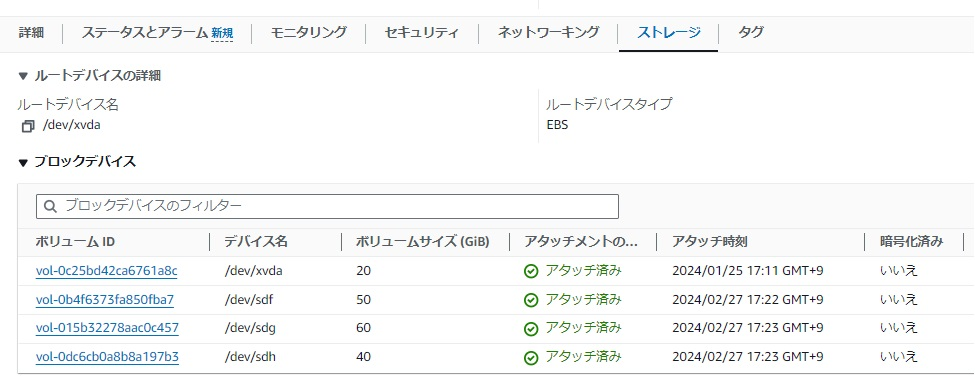

==============
ストレージ管理
==============

ストレージの管理構成
====================

Amazon LinuxをAMIから特に指定なくEC2を作成すると1つのEBSがアタッチされた状態で起動します。
ここではストレージ周りの利用方法を示します。

EC2のストレージはAWSマネージメントコンソール上でEBSを作成し、EC2にアタッチします。
OS上でアタッチされたストレージを利用可能にし、ファイルシステムを作成してからマウントできます。
手順を順序で書き直すと以下のようになります。

1) EBSを作成
2) EC2にアタッチ
3) OSでストレージにファイルシステムを作成
4) OSでファイルシステムを作ったストレージをマウント

ストレージ管理コマンド
======================

Amazon Linuxでのストレージ管理に多用するコマンドは以下です。

.. csv-table:: ストレージ管理コマンド
    :header: "コマンド名", "説明"
    :widths: 15, 10

    "df", ファイルシステムやディスクの利用量を表示する  
    "mount", ファイルシステムをマウント、マウントされているファイルシステムの一覧表示などを行う
    "lsblk", ブロックデバイスをリスト表示する
    "blkid", ブロックデバイスの属性を表示する
    "parted", パーティションをリスト、編集する

ストレージを追加、マウントする
==============================

ここではAMIからAmazon Linuxを作成した後、EBSストレージをアタッチしてOSからマウントできるまでの手順を示します。

まずはAWSマネージメントコンソールでEBSを複数作成してEC2にアタッチします。
ここでは40GB, 50GB, 60GBのEBSを用意し、アタッチしました。

AMIから起動したてのAmazon Linuxでdfコマンドを実行すると次のように出力されます。
AWSマネージメントコンソールで見えていた20GBの「/dev/xvda」は「/dev/nvme0n1」としてOSからは見えているようです。

.. code-block:: bash

    $ df
    Filesystem       1K-blocks    Used Available Use% Mounted on
    devtmpfs              4096       0      4096   0% /dev
    tmpfs               463372       0    463372   0% /dev/shm
    tmpfs               185352     488    184864   1% /run
    /dev/nvme0n1p1    20893676 3137380  17756296  16% /
    tmpfs               463376       0    463376   0% /tmp
    /dev/nvme0n1p128     10202    1306      8896  13% /boot/efi
    tmpfs                92672       0     92672   0% /run/user/1000

出力には「/dev/nvme0n1」だけの表示がありません。末尾に「p1」と「p128」がついているデバイス名があります。
これは「/dev/nvme0n1」をパーティションしたストレージが表示されています。partedコマンドで確認してみましょう。

.. code-block:: bash

    $ sudo parted -l
    Model: Amazon Elastic Block Store (nvme)
    Disk /dev/nvme0n1: 21.5GB
    Sector size (logical/physical): 512B/512B
    Partition Table: gpt
    Disk Flags:

    Number  Start   End     Size    File system  Name                  Flags
    128     1049kB  11.5MB  10.5MB  fat16        EFI System Partition  boot, esp
    127     11.5MB  12.6MB  1049kB               BIOS Boot Partition   bios_grub
     1      12.6MB  21.5GB  21.5GB  xfs          Linux

「Number」に出てくる番号が末尾についている数字と一致します。Number 128はEFIブートで利用されます。
Number 1がLinuxとして利用されるパーティションです。Sizeが21GB、ファイルシステムはXFSを利用しているのがわかります。

EBSがEC2にアタッチされるとブロックデバイスとしてOSで認識されます。lsblkコマンドで確認します。
40GB, 50GB, 60GBのストレージが無事認識されています。ここで見えていない場合はアタッチに失敗している可能性があるのでAWSマネージメントコンソールで確認しましょう。

.. code-block:: bash

    $ lsblk
    NAME          MAJ:MIN RM SIZE RO TYPE MOUNTPOINTS
    nvme0n1       259:0    0  20G  0 disk
    ├─nvme0n1p1   259:4    0  20G  0 part /
    ├─nvme0n1p127 259:5    0   1M  0 part
    └─nvme0n1p128 259:6    0  10M  0 part /boot/efi
    nvme1n1       259:1    0  50G  0 disk
    nvme3n1       259:2    0  40G  0 disk
    nvme2n1       259:3    0  60G  0 disk

OSでストレージが認識されているのでファイルシステムを作りましょう。
1つずつファイルシステムを作るなら以下のように実施します。ここではXFSを利用します。

.. code-block::

    $ sudo /usr/sbin/mkfs.xfs /dev/nvme1n1

今回のように複数ストレージがある場合、以下のようにfor文で回すと楽です。

.. code-block::

    $ for i in {1..3}; do
        sudo /usr/sbin/mkfs.xfs /dev/nvme${i}nvme1n1
    done

ファイルシステムを作ったらマウントします。
ここでは以下のようにマウントポイントを作成してEBSをマウントします。

.. csv-table:: ストレージとマウントポイント
    :header: "AWS上のデバイス名", "OS上のデバイス名", "サイズ", "マウントポイント"
    :widths: 15, 10, 10, 10

    "/dev/xvda", "/dev/nvme0n1p1", "20GB", "/  (すでにマウント済)"
    "/dev/sdf", "/dev/nvme1n1", "50GB", "/opt/var"
    "/dev/sdg", "/dev/nvme2n1", "60GB", "/srv"
    "/dev/sdh", "/dev/nvme3n1", "40GB", "/data"

手動でマウントする場合、次のコマンドのどちらかでマウントできます。
/dev/sd* というデバイス名が /dev/nvme*n1 にシンボリックリンクが貼られているため、どちらのコマンドでもマウントを実施できます。

.. code-block::

    $ sudo /dev/sdg /srv
    $ sudo /dev/nvme2n1 /srv

システム起動時に自動でマウントさせるためには /etc/fstab を記載します。
/etc/fstab のフォーマットを確認しておきましょう。

.. code-block::

    $ cat /etc/fstab
    #
    UUID=af805cc0-8447-4b55-8c57-ea294e4bea9c     /           xfs    defaults,noatime  1   1
    UUID=94FC-EE88        /boot/efi       vfat    defaults,noatime,uid=0,gid=0,umask=0077,shortname=winnt,x-systemd.automount 0 2

1行にストレージデバイス名、マウントポイント、ファイルシステム、マウントオプションの順に記載します。

ストレージデバイス名は「UUID=」から始まる、ストレージ毎にユニークなIDを利用します。
ストレージはOSが起動時に見つけた順番に/dev/sd*や/dev/nvme*n1の番号を振っていきます。
期待通りのデバイス名がストレージに付与されるようにはUUIDでの管理がベストです。

UUIDはblkidコマンドで出力します。

.. code-block::

    $ sudo blkid /dev/nvme1n1
    /dev/nvme1n1: UUID="9ea5a571-96cd-4ccd-8caf-98964f63eb8a" BLOCK_SIZE="512" TYPE="xfs"

このUUIDを使って/etc/fstabに追記していきます。編集後の /etc/fstab が以下です。

.. code-block::

    $ cat /etc/fstab
    #
    UUID=af805cc0-8447-4b55-8c57-ea294e4bea9c     /           xfs    defaults,noatime  1   1
    UUID=94FC-EE88        /boot/efi       vfat    defaults,noatime,uid=0,gid=0,umask=0077,shortname=winnt,x-systemd.automount 0 2

    UUID=9ea5a571-96cd-4ccd-8caf-98964f63eb8a       /opt/var        xfs     defaults        0       0
    UUID=1ca25b7b-187d-4dd1-82b6-b1c094de602a       /srv            xfs     defaults        0       0
    UUID=d85e0756-0b7a-48ef-9110-4779e4152e06       /data           xfs     defaults        0       0

ここでマウントポイントとして存在していない /opt/var と /data はあらかじめ mkdir で作成しておきましょう。

次に /etc/fstab を使ってマウントのテストです。mountコマンドに -a オプションをつけると /etc/fstab にあるマウントエントリをすべてマウントします。再起動前の確認にぜひ使いましょう。次のコマンド実行例は、mountしてdfでマウントされていることを確認します。

.. code-block::

    $ sudo mount -a
    $ df
    Filesystem       1K-blocks    Used Available Use% Mounted on
    devtmpfs              4096       0      4096   0% /dev
    tmpfs               463372       0    463372   0% /dev/shm
    tmpfs               185352     492    184860   1% /run
    /dev/nvme0n1p1    20893676 3137608  17756068  16% /
    tmpfs               463376       0    463376   0% /tmp
    /dev/nvme0n1p128     10202    1306      8896  13% /boot/efi
    tmpfs                92672       0     92672   0% /run/user/1000
    /dev/nvme2n1      62849024  472016  62377008   1% /srv
    /dev/nvme1n1      52363264  398932  51964332   1% /opt/var
    /dev/nvme3n1      41877504  325784  41551720   1% /data

無事、追加したストレージがマウントされていることを確認できました。
再起動して同じようにdfコマンドを使ってマウントされていることを確認しましょう。