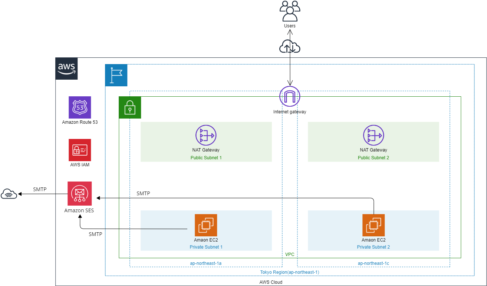
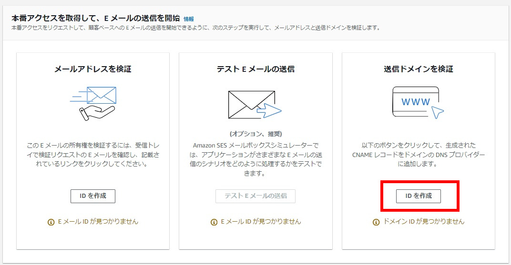
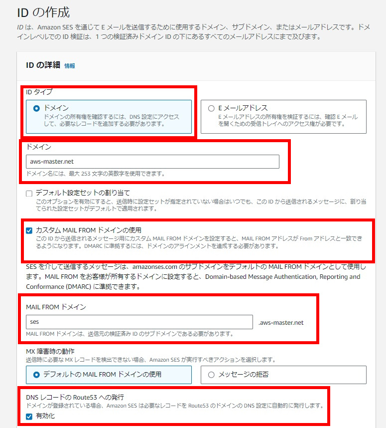
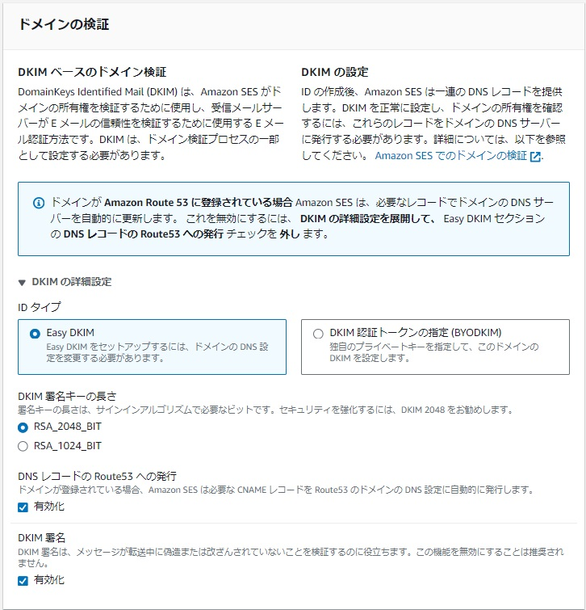
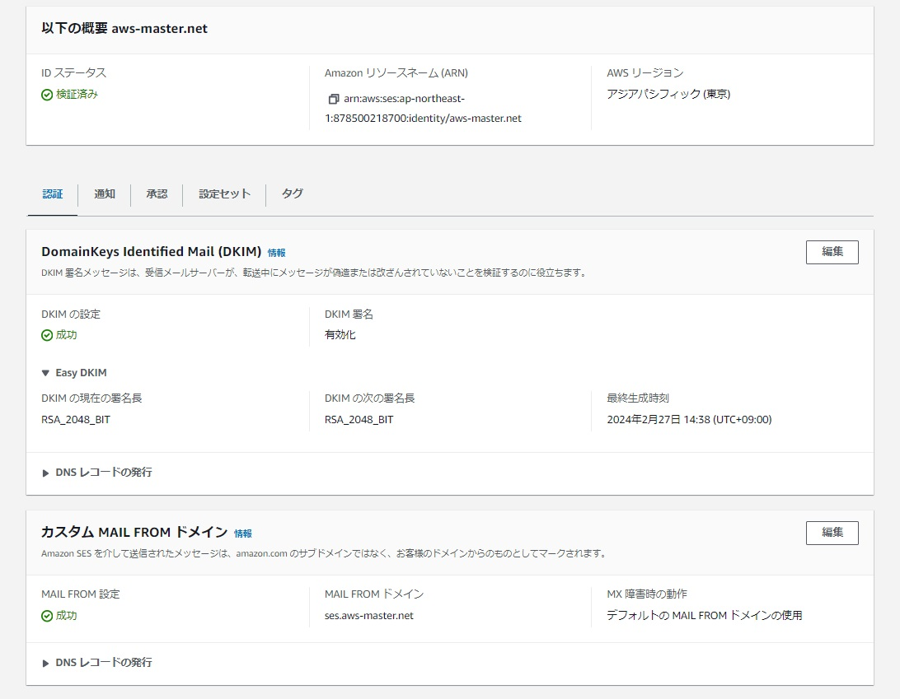
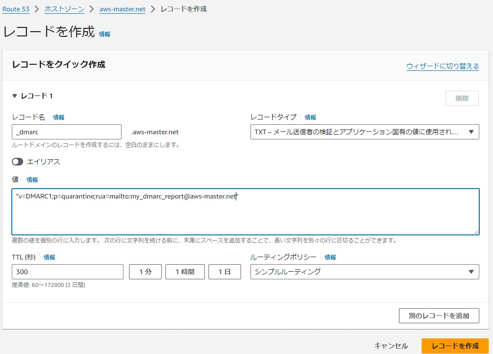
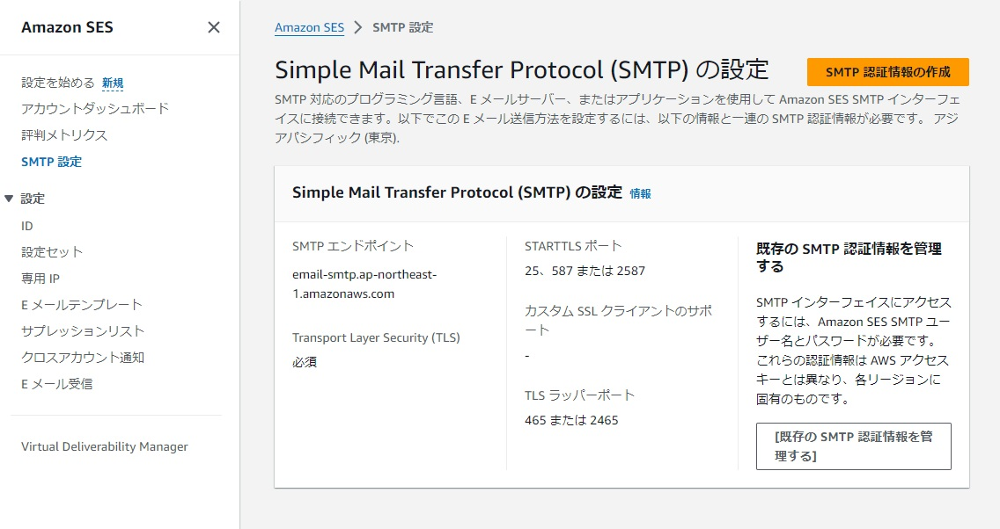
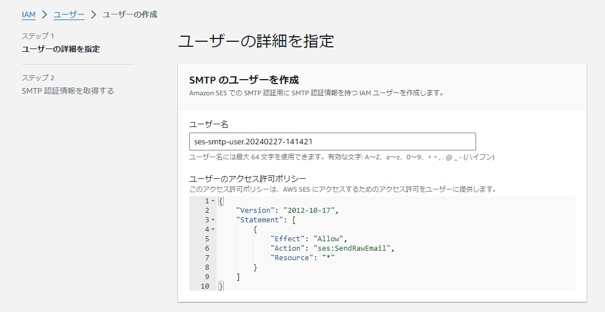
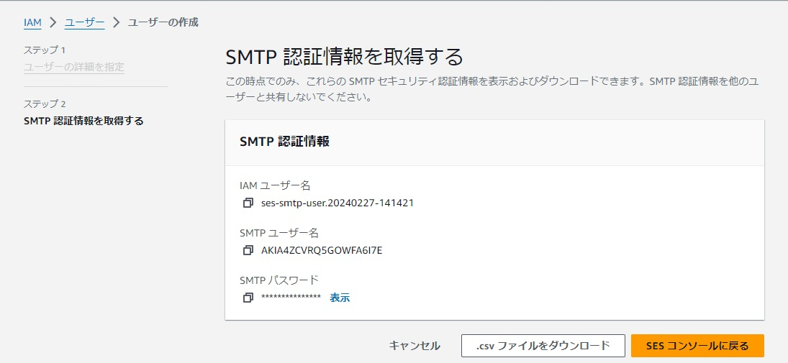

==============
SMTPサーバ構築
==============

EC2上でメールの送信、メールの転送を行う場合に構築します。
EC2上のWebサーバで稼働するWebアプリや、サーバ上での定期実行結果の送信にも有効利用できます。

SMTPサーバ運用構成
==================

Amazon LinuxにSMTPサーバとしてPostfixをインストールして稼働します。
インターネットにメールを送信するならば、Amazon SESを経由することでDKIMやDmarcヘッダを付加することができます。
ここではAmazon SESを経由する方法を推奨して記載します。

もちろん、Amazon SESを経由せずにメールを転送することも可能ですが、DKIMの仕組みはOSに別途用意する必要があります。
Amazon Linux 2023は、2024年2月現在ではDKIMを実装するOpenDKIMなどのパッケージが提供されていません。

Postfixのインストール
=====================

dnfコマンドを使ってpostfixパッケージをインストールします。

.. code-block::

    dnf install postfix

Postfixの設定
=============

postfixの設定ファイルは/etc/postfix以下に配置されます。

* /etc/postfix/main.cf: 全体的な設定ファイル

メールを送信する際のドメイン設定は以下が記述されていれば最低限の動作が可能です。

.. code-block::

    mydomain = aws-master.net  # メールFromの@以降に付与するドメイン名の定義
    myorigin = $mydomain       # メールFromの@以降に付与するドメイン名指定
    inet_interfaces = all      # bindするNIC名。localhostやホスト名を指定する。
    inet_protocol = all        # IPv4 or IPv6 or allを指定する。
    mydestination = $myhostname, localhost.$mydomain, localhost  # 自分が受け取る宛先ドメインの指定

Amazon SES経由でのメール送信
============================

Amazon SESのページに移動してIDを作ります。
ここでSPF, DKIMの設定も同時に行います。

ここではドメイン単位でメールの送信を行うことを想定してSES IDを作成します。
Amazon SESの画面で作成するIDについて「IDを作成」ボタンをクリックします。

下の画面でドメインやDMARCで使うためのカスタムMAIL FROMドメインの使用、MAIL FROMドメインの指定を行います。
Route53をDNSに利用しているならば、DMARCレコード以外は自動で設定してくれるので「有効化」にチェックを入れます。

画面を下に移動し、「ドメインの検証」を設定し、DKIM署名の設定を行います。

設定が終わり、IDを作成します。設定後は「DKIMの設定」などで「検証中」と表示されますが5-10分程度で「成功」と表示されるはずです。

ここでRoute53にSPFやDKIMのレコードが追加されていることを確認しましょう。
Route53以外のDNSを利用している場合は、画面上の「DNSレコードの発行」をクリックしてDNSにレコード追加します。

DMARCのDNSレコードは自動で追加されないため、別途DNSに手動で指定します。

.. code-block::

    _dmarc.aws-master.net   TXT  "v=DMARC1;p=quarantine;rua=mailto:admin@aws-master.net"

再びAmazon SESのページに移動してSMTP認証情報を取得します。
左メニューから「SMTP設定」を選択し、右にある「SMTP認証情報の作成」をクリックします。

ここでIAMユーザ作成画面になるのでSMTPユーザを作成します。ユーザ名が決め打ちで入力されていますが、任意の文字列に変更可能です。

IAMユーザを作成するとIAMユーザ名、SMTPユーザ名とSMTPパスワードが発行されます。
これは二度とみられなくなる情報なのでCSVをダウンロードする、ファイルに記載するなどして紛失しないようにします。

/etc/postfix/main.cf の末尾に以下を追加します。(すでに有効になっている場合は重複しないように気を付けること)

.. code-block::

    relayhost = [email-smtp.ap-northeast-1.amazonaws.com]:25   # メールの転送先設定。ここではSESのエンドポイントを指定する。
    smtp_sasl_auth_enable = yes
    smtp_sasl_password_maps = hash:/etc/postfix/sasl_passwd    # SMTP認証情報を記載するファイルを指定する。
    smtp_sasl_security_options = noanonymous

/etc/postfix/sasl_passwd は任意のファイル名で良いですが、ここに指定したファイルにAmazon SESの認証情報を記載します。
フォーマットは「[SMTPエンドポイント名]:ポート番号  SMTPユーザ名:SMTPパスワード」です。SMTPエンドポイントは「[]」で囲むことを忘れないこと。

.. code-block::

    [email-smtp.ap-northeast-1.amazonaws.com]:25    AKIA4(snip1)PGYKL53:BKYv7/64DDZ(snip2)TAV+8+0DI

ファイルを作成した後、postconfコマンドでDB化します。

.. code-block::

    cd /etc/postfix
    postmap sasl_passwd

有効化するため、postfixを再起動します。

.. code-block::

    systemctl restart postfix

Postfixのトラブルシュート
=========================

EC2からメールを送信するにはtelnetコマンドか、mailコマンドを利用するのが簡単です。
telent, mailコマンドが無い場合、「dnf install telnet」もしくは「dnf install mailx」を実行してインストールします。

telnetコマンドの場合、以下のようにコマンドするとメールを送信できます。

.. code-block::

    $ telnet localhost 25
    Trying 127.0.0.1...
    Connected to localhost.
    Escape character is '^]'.
    220 ip-192-168-3-78.ap-northeast-1.compute.internal ESMTP Postfix
    helo ip-192-168-3-78
    250 ip-192-168-3-78.ap-northeast-1.compute.internal
    mail from: ec2-user@aws-master.net
    250 2.1.0 Ok
    rcpt to: kutsuna@example.com
    250 2.1.5 Ok
    data
    354 End data with <CR><LF>.<CR><LF>
    Subject: This is test mail via ses, 2
    test
    .
    250 2.0.0 Ok: queued as 6751E7900E
    quit
    221 2.0.0 Bye
    Connection closed by foreign host.

mailコマンドの場合、以下のようにコマンドするとメールを送信できます。

.. code-block::

    $ mail kutsuna@example.com
    Subject: test mail via ses, 1
    test
    .
    EOT

ログを確認する場合は journalctl を利用します。
期待通り送信されていると、EC2からは以下のログのように「status=sent (250 OK」のメッセージが記載されます。
ここがbounceなど、「sent」以外の場合はAmazon SESが転送を受け取っていない状態なので、SMTPサーバの設定を確認しましょう。

.. code-block::

    $ journalctl -f -u postfix
    Feb 27 05:22:01 (EC2名) postfix/pickup[27413]: 9D0FF79018: uid=1000 from=<ec2-user>
    Feb 27 05:22:01 (EC2名) postfix/cleanup[27610]: 9D0FF79018: message-id=<(メッセージID)>
    Feb 27 05:22:01 (EC2名) postfix/qmgr[27414]: 9D0FF79018: from=<ec2-user@aws-master.net>, size=529, nrcpt=1 (queue active)
    Feb 27 05:22:02 (EC2名) postfix/smtp[27612]: 9D0FF79018: to=<kutsuna@example.com>, relay=email-smtp.ap-northeast-1.amazonaws.com[192.168.3.82]:25, delay=0.4, delays=0.03/0.08/0.11/0.18, dsn=2.0.0, status=sent (250 Ok (メールID))
    Feb 27 05:22:02 (EC2名) postfix/qmgr[27414]: 9D0FF79018: removed

メールを送信したあとは受信側でメールのヘッダなどを確認しましょう。